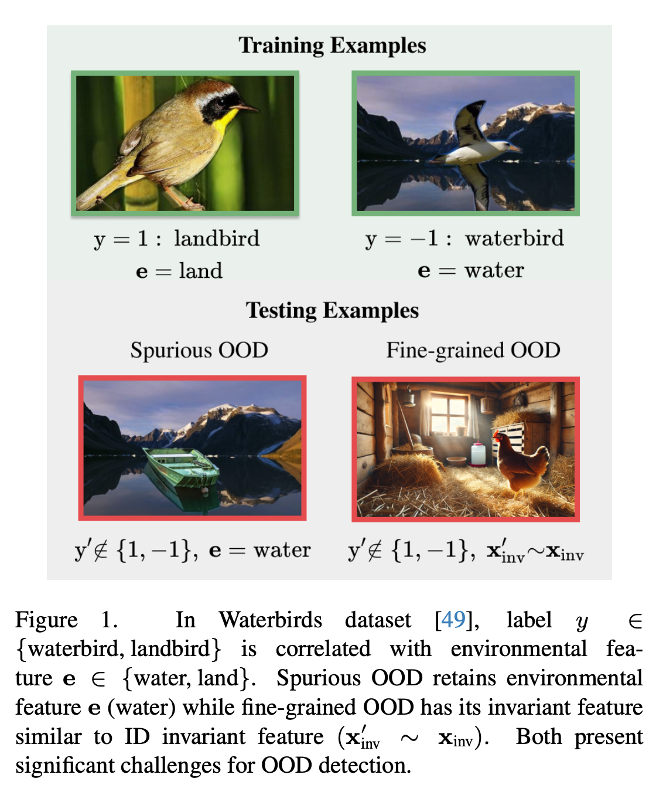
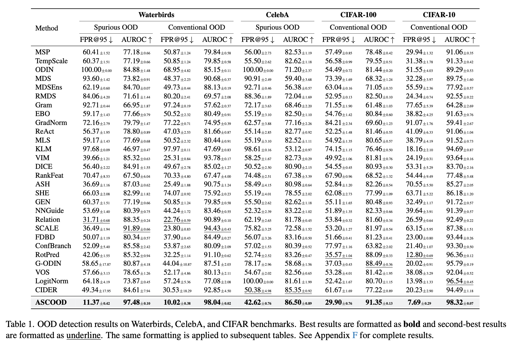
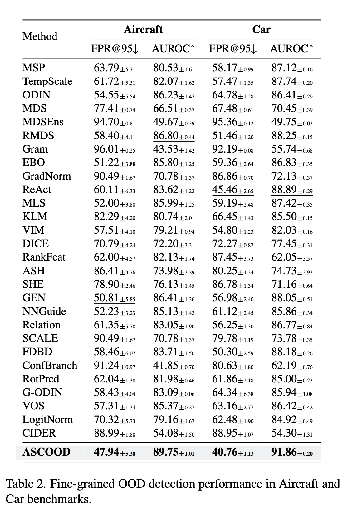
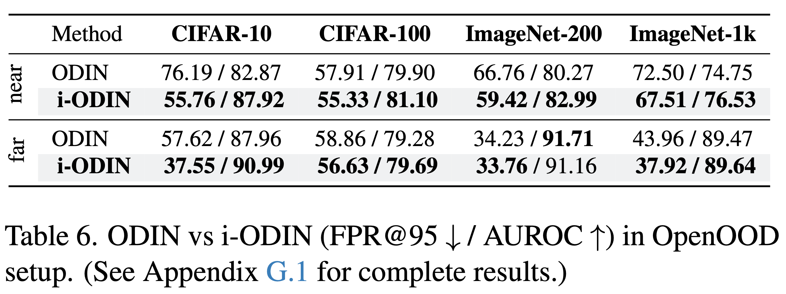
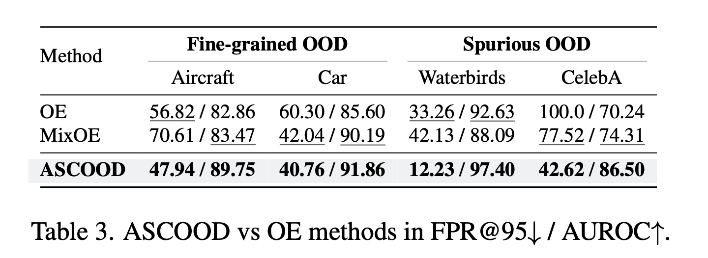
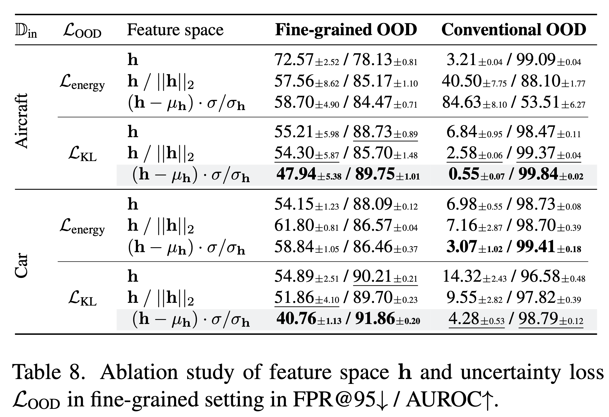
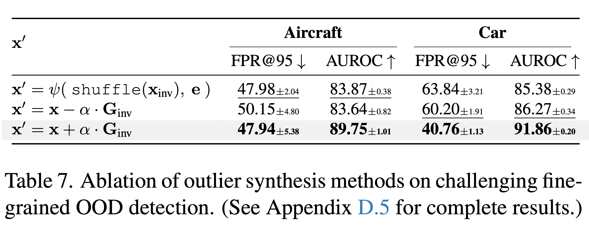
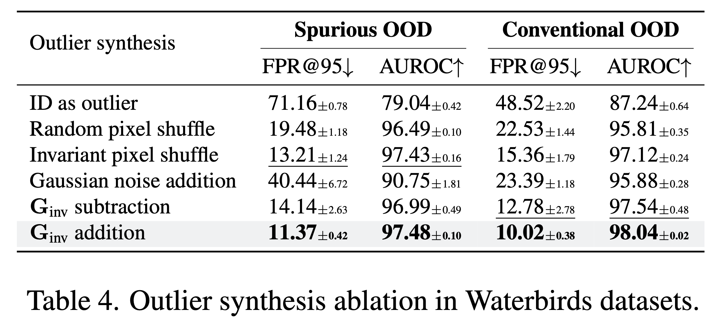

# Going Beyond Conventional OOD Detection 
This codebase provides a Pytorch implementation of:

>**Going Beyond Conventional OOD Detection**  
[](https://arxiv.org/abs/2411.10794)  
[](https://arxiv.org/abs/2411.10794)  
Sudarshan Regmi

<p align="center">
  
</p>

## Abstract
Out-of-distribution (OOD) detection is critical to ensure the safe deployment of deep learning models in critical applications. Deep learning models can often misidentify OOD samples as in-distribution (ID) samples. This vulnerability worsens in the presence of spurious correlation in the training set. Likewise, in fine-grained classification settings, detection of fine-grained OOD samples becomes inherently challenging due to their high similarity to ID samples. However, current research on OOD detection has largely ignored these challenging scenarios, focusing instead on relatively easier (conventional) cases. In this work, we present a unified Approach to Spurious, fine-grained, and Conventional OOD Detection (ASCOOD). First, we propose synthesizing virtual outliers from ID data by approximating the destruction of invariant features. To this end, we identify invariant features with the pixel attribution method using the model being learned. This approach eliminates the burden of curating external OOD datasets. Then, we simultaneously incentivize ID classification and predictive uncertainty towards virtual outliers leveraging standardized feature representation. Our approach effectively mitigates the impact of spurious correlations and encourages capturing fine-grained attributes. Extensive experiments across seven datasets demonstrate the merit of ASCOOD in spurious, fine-grained, and conventional settings.

<span>Check other works:</span>

<a href="https://github.com/sudarshanregmi/t2fnorm"></a> <br>
<a href="https://github.com/sudarshanregmi/reweightood"></a> <br>
<a href="https://github.com/sudarshanregmi/adascale"></a>

### Follow [OpenOOD](https://github.com/Jingkang50/OpenOOD) official instruction to complete the setup.
```
pip install git+https://github.com/Jingkang50/OpenOOD
```

## Datasets
<!--### In-distribution Datasets-->

- Spurious setting:
  - Waterbirds (spurious correlation ~ 0.9)
  - CelebA (spurious correlation ~ 0.8)
- Fine-grained setting:
  - Car
  - Aircraft
- Conventional setting:
  - CIFAR-10
  - CIFAR-100

Visit [Google Drive](https://drive.google.com/drive/folders/137JTYkq4ykJ1NwP_LIYkowQEgegtsKp-?usp=sharing) for datasets and checkpoints.

You may download necessary datasets and checkpoints with the following command:
```bash
bash scripts/download/download_ascood.sh
```

These datasets are adapted from [OpenOOD](https://github.com/Jingkang50/OpenOOD), [Spurious_OOD](https://github.com/deeplearning-wisc/Spurious_OOD) and [MixOE](https://github.com/zjysteven/MixOE).

### Example Scripts for ASCOOD Training and Inference
Use the following scripts for training and inferencing the ASCOOD model:

```bash
bash scripts/ood/ascood/waterbirds_train_ascood.sh
bash scripts/ood/ascood/waterbirds_test_ascood.sh
```
Other similar scripts are available in ```scripts/ood/ascood``` folder.

Example of training script (eg. ```scripts/ood/ascood/waterbirds_train_ascood.sh```):
```
python main.py \
    --config configs/datasets/waterbird/waterbird.yml \
    configs/networks/ascood_net.yml \
    configs/pipelines/train/train_ascood.yml \
    configs/preprocessors/ascood_preprocessor.yml \
    --network.backbone.name resnet18_224x224 \
    --network.backbone.pretrained True \
    --network.backbone.checkpoint ./results/pretrained_weights/resnet18-f37072fd.pth \
    --optimizer.lr 0.01 \
    --optimizer.num_epochs 30 "$@"
```

ASCOOD model uses these hyperparameters: ```p_inv, ood_type, alpha_min, alpha_max, w, sigma```
- p_inv : percent of pixels treated as invariant ones (eg. 0.1)
- ood_type : type of synthesized outlier (eg. gradient, shuffle, gaussian)
- w : weight of uncertainty loss (eg. 1.0)
- sigma : sigma of feature representation (eg. 0.5)
- alpha_min: initial value of alpha (eg. 30.0)
- alpha_max: final value of alpha (eg. 300.0) [alpha is calculated by linearly decreasing its value from alpha_max to alpha_min over the course of the training epochs.]

Training arguments can be passed as:
```bash
bash scripts/ood/ascood/waterbirds_train_ascood.sh --trainer.trainer_args.ood_type gradient
```
[--optimizer.fc_lr_factor is set to 1.0 everywhere except in CIFAR-100 where it is adjusted to 0.05]

Note: We use ```configs/preprocessor/ascood_preprocessor.yml``` across entire experiments for all methods.

Example of inference script (eg. ```scripts/ood/ascood/waterbirds_test_ascood.sh```):

```bash
python scripts/eval_ood.py \
   --id-data waterbirds \
   --wrapper-net ASCOODNet \
   --root ./results/waterbird_ascood_net_ascood_e30_lr0.01_w0.1_p0.1_otype_gradient_nmg_30.0_300.0_default \
   --postprocessor odin --save-score --save-csv
```

### Example Scripts for i-ODIN inference
Use the following scripts for inference using i-ODIN postprocessor:

```bash
bash scripts/ood/iodin/cifar10_test_ood_iodin.sh
bash scripts/ood/iodin/cifar100_test_ood_iodin.sh
bash scripts/ood/iodin/imagenet200_test_ood_iodin.sh
bash scripts/ood/iodin/imagenet_test_ood_iodin.sh
```

### Pre-trained checkpoints
Pre-trained models are available in the given links:

- Waterbirds [[Google Drive]](https://drive.google.com/drive/folders/1O-iy2kvJNYM42-FJ9vmelULpT2HatDCV?usp=sharing): ResNet-18 backbone fine-tuned on Waterbirds datasets with ASCOOD across 3 trials.
- CelebA [[Google Drive]](https://drive.google.com/drive/folders/1ZV2I6xMQWwbjKpV9olkoAIVAptCK64yi?usp=sharing): ResNet-18 backbone fine-tuned on CelebA datasets with ASCOOD across 3 trials.
- Car [[Google Drive]](https://drive.google.com/drive/folders/19jauyKZBnavtPK_-0iypbxnaWhtJXCbr?usp=drive_link): ResNet-50 backbone fine-tuned on Car datasets with ASCOOD across 3 trials.
- Aircraft [[Google Drive]](https://drive.google.com/drive/folders/1BUo6XwRLbY-5PnyrJczrWJRUgdx1hoMx?usp=drive_link): ResNet-50 backbone fine-tuned on Aircraft datasets with ASCOOD across 3 trials.
- CIFAR-10 [[Google Drive]](https://drive.google.com/drive/folders/15OFUcE_MuTsQe29pR6SSxlzefx_mZTFi?usp=drive_link): ResNet-18 backbone trained on CIFAR-10 datasets with ASCOOD across 3 trials.
- CIFAR-100 [[Google Drive]](https://drive.google.com/drive/folders/1oTpZfuad0YTXdtjEEGblY46Ti-aHJPcF?usp=drive_link): ResNet-18 backbone trained on CIFAR-100 datasets with ASCOOD across 3 trials.

### Results
- Spurious and Conventional setting:
<p align="center">
  
</p>

- Fine-grained setting:
<p align="center">
  
</p>

- ODIN vs. i-ODIN:
<p align="center">
  
</p>

- Comparison with OE methods:
<p align="center">
  
</p>

- Ablation studies
<p align="center">
  
</p>

<p align="center">
  
</p>

<p align="center">
  
</p>

### Consider citing this work if you find it useful.

```
@misc{regmi2024goingconventionalooddetection,
      title={Going Beyond Conventional OOD Detection},
      author={Sudarshan Regmi},
      year={2024},
      eprint={2411.10794},
      archivePrefix={arXiv},
      primaryClass={cs.CV},
      url={https://arxiv.org/abs/2411.10794},
}
```
### Acknowledgment
This codebase builds upon [OpenOOD](https://github.com/Jingkang50/OpenOOD).
